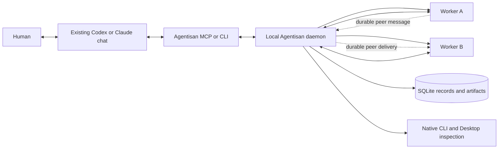
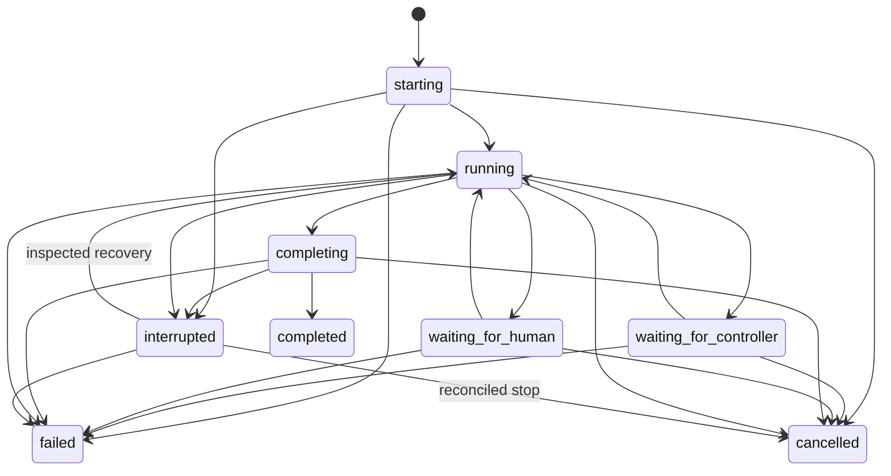

# Interactive agent teams v3

**Status: design proposal. None of the v3 behavior in this document is shipped yet.** The current
implementation remains the core-v2 service-owned lead described in [Live CLI teams](live-teams.md).

## Decision

Agentisan v3 makes the developer's existing agent chat the default coordination owner. The chat
decomposes the objective, starts workers, assigns work, receives durable updates, asks the human for
decisions when needed, and synthesizes the result. Agentisan owns worker execution, communication,
budgets, recovery, session bindings, and receipts.

A second model coordinator is not created for an interactive run. Service-owned model coordination
remains available as an explicit `autonomous` mode for unattended jobs.

### What changes from core-v2

| Concern | Core-v2 | V3 default |
|---|---|---|
| Coordinator | Service launches another model lead. | The developer's existing main chat coordinates. |
| MCP surface | Agent, observer, and per-team controller profiles. | One generic Agentisan server with four tools. |
| Team definition | Static JSON with a required managed lead. | Dynamic run roster with optional reusable templates. |
| Startup | Manual service, port, credential path, and host configuration. | One-time integration plus an OS-managed daemon. |
| Progress | Repeated inspect/watch commands. | Cursor-based bounded wait returning meaningful changes. |
| Coding | Consultation-oriented workers. | Read workers first, then isolated writer workspaces. |
| Unattended work | Default topology. | Explicit `autonomous` mode. |

The existing persistence, message commit, native-session, bounded-execution, decision, recovery, and
verification work remains the foundation. V3 replaces the coordination and integration layers.



The main chat is a controller at the Agentisan boundary. A generic MCP transport does not prove the
host conversation's native identity, so records identify the controller connection and credential
rather than claiming a Codex or Claude conversation ID. This limitation does not require a second
model lead.

## Product contract

### Normal developer flow

1. Install Agentisan once for the chosen host.
2. Open an ordinary project chat in Codex, Claude, or another supported MCP client.
3. Plan normally with the main agent.
4. Say “start an agent team”, “ask your team”, or an equivalent request.
5. Approve one bounded live-provider envelope when the host requires it.
6. Continue working in the same chat while workers run and communicate.
7. Receive worker findings, inspect their sessions when useful, and let the main agent synthesize or
   integrate the accepted result.

No daily workflow should require ports, token paths, profile names, static team JSON, a separate
Agentisan-created chat, or a manually started service.

### Invocation language

The distributable Agentisan skill should implicitly match when `team` refers to AI agents, including:

- “agent team” or “team of agents”;
- “start/use/ask your team”;
- “delegate this to a team”;
- “have multiple agents review or implement this”;
- explicit `$agentisan` or a request to use Agentisan MCP tools.

The description must exclude human, organizational, and sports teams. Mentioning a possible team
does not authorize provider calls. An instruction to start, use, delegate to, or ask the agent team
does authorize a bounded run within the user's stated scope. Materially broader work still needs a
human decision.

The main agent should use a team when independent investigation, implementation, or review lanes are
likely to improve the accepted result. It should keep trivial and tightly sequential work local. The
default team has two workers with distinct roles; a third worker needs a clear independent lane.

### Installation flow

The proposed interface is shown below. These commands are design targets and are not runnable in
core-v2:

```sh
agentisan integrate codex
agentisan integrate claude
```

An integration command installs or upgrades the daemon, provisions a local operator credential,
installs the Agentisan skill, and registers one generic Agentisan MCP server. It verifies the daemon,
MCP handshake, provider CLIs, authentication route, and supported native-open capabilities without
making a model call. Repeating the command is idempotent.

Codex distribution should use a plugin that bundles the skill and thin MCP connector. Codex clients
share MCP configuration, while skill descriptions provide implicit discovery. The connector talks to
the durable daemon; it does not own SQLite or worker processes. A host restart may be needed once
after first installation when a new connector is added. Skill changes are discovered independently;
if a host does not refresh them, it can also require a restart.

The daemon runs as a user service: launchd on macOS, systemd user service on Linux, and a per-user
Windows service or scheduled task on Windows. `agentisan doctor` reports the exact failing layer.

### Runtime components

| Component | Responsibility |
|---|---|
| Agentisan skill | Recognize agent-team intent and teach the main agent the smallest useful tool flow. |
| Thin MCP connector | Translate one host connection into the stable Agentisan tool contract. It stores no team state. |
| Local daemon | Own scheduling, leases, budgets, persistence, recovery, and provider processes. |
| Provider adapters | Discover capabilities and start, resume, cancel, inspect, and open native sessions. |
| Workspace manager | Pin revisions and allocate isolated reader or writer workspaces. |
| SQLite store | Hold canonical state, receipts, bindings, messages, and event cursors. |
| CLI/dashboard | Provide automation, administration, recovery, and human inspection over the same daemon API. |

The default daemon transport is an owner-only Unix-domain socket on macOS/Linux and an ACL-restricted
named pipe on Windows. This removes project-visible ports and credential arguments. An optional
numeric loopback HTTP listener remains available for development and remote-executor adapters. The
thin connector performs a bounded health check and may ask the installed OS service manager to start
the daemon; it never creates an unmanaged detached process.

Repository policy can live in a checked-in `.agentisan.toml`; user provider routes and secrets remain
in private configuration. Team templates supply reusable defaults but do not force a static roster.

## Coordination modes

### Interactive mode — default

The existing main chat owns decomposition and synthesis. `team_start` atomically creates a run,
controller lease, roster, initial work items, budget envelope, and receipts. Workers can execute and
exchange messages while the controller is disconnected. Work that requires new controller input
waits durably instead of spawning another coordinator.

The controller lease provides one writer at a time. It is evidence of a scoped Agentisan control
capability, not evidence of a particular provider-native chat. `team_start` mints an unguessable
per-run control handle, stores only its hash, and returns it only in the initiating tool result. Every
mutation requires that handle and checks the run, controller epoch, connector instance, expected run
version, and lease expiry.

The handle is derived from a daemon master key, the unguessable run ID, and capability epoch. The
master key remains in an owner-only keystore; SQLite stores the capability hash and epoch. This lets
the daemon reproduce the same handle for an exact authorized start retry without storing plaintext.
Rotation increments the capability epoch and invalidates the old handle.

Each thin connector also generates an instance ID at startup and authenticates to the daemon with the
local operator credential. A host may share that connector process among several chats, so the
connector ID alone never authorizes run mutation. Another chat cannot control a run merely because it
shares the operator credential; it must also possess that run's control handle. Optimistic run
versions then prevent silent lost updates among holders of the same delegated capability.

Read-only status calls never acquire or renew control. An accepted mutation renews the short lease and
binds it to that connector instance. After expiry, the same control handle can acquire a new lease and
increment the coordination epoch; stale connector writes remain fenced. Transfer to a chat that lacks
the handle requires an explicit handoff from the current holder or a trusted CLI/dashboard recovery
operation after inspection. There is no “latest chat wins” rule.

### Autonomous mode — explicit

`team_start(mode: "autonomous")` creates a managed model lead using a configured policy. The service
resumes that lead as work arrives. This is appropriate for scheduled or unattended jobs and preserves
the current core-v2 topology.

Interactive and autonomous coordination cannot be active for the same run. Mode transfer increments
the coordination epoch and fences the old owner before the new owner can act.

## Domain model

### Stable entities

| Entity | Purpose |
|---|---|
| Workspace | Repository/path plus pinned revision and policy. |
| Team template | Optional reusable policy and worker defaults; never a required static roster. |
| Run | One objective, coordination mode, root limits, lifecycle, and result. |
| Actor | Human, controller, managed agent, verifier, or system identity in one run. |
| Worker | Provider adapter, model class, role brief, capabilities, and native binding. |
| Work item | Objective, done criteria, assignee, dependencies, attempt, budget slice, and state. |
| Message | Durable sender/recipient/correlation record, optionally attached to a work item. |
| Artifact | Immutable content hash, producer, revision, type, and workspace relationship. |
| Decision | Human input requested against exact scope and artifact revisions. |
| Receipt | Idempotent acceptance, commit, execution, cancellation, verification, or recovery evidence. |
| Event | Bounded ordered projection for cursors, dashboard updates, and audit. |

Actors replace the current assumption that every message recipient must be a managed agent. An
interactive controller has a durable mailbox but is never scheduled as a native worker.

### Run lifecycle



Terminal states are `completed`, `failed`, and `cancelled`. Cancellation and failure are defined from
every ordinary nonterminal state. `interrupted` records uncertain native effects and never triggers
automatic replay; it can become cancelled only after the uncertain effect is reconciled. The waiting
states are durable and non-busy.

A run enters a waiting state only when it has no active native effect. Independent work may continue
while one work item needs input, in which case the run remains `running` and exposes the blocked item
through `team_status`.

### Work-item lifecycle

`proposed → ready → running → reported → accepted | rejected | cancelled | exhausted | unknown`

Dependencies control admission into `ready`; they do not impose a permanent DAG restriction on the
whole run. A revision or retry creates a new attempt identity. Reported work becomes accepted only
when the controller or configured verifier records acceptance.

## MCP interface

Agentisan exposes one server named `agentisan`. Tool names stay stable across providers. The server
instructions explain interactive ownership, live-provider authorization, and the distinction between
controller connection identity and provider-native chat identity.

### Essential tools

| Tool | Behavior | Annotation intent |
|---|---|---|
| `team_start` | Atomically create an interactive or autonomous run and return immediately. | write, idempotent, open-world |
| `team_status` | Inspect immediately or wait after an opaque cursor for meaningful changes. | read-only |
| `team_update` | Assign work, send a message, accept/reject work, or finish within the existing run envelope. | write, idempotent |
| `team_cancel` | Request bounded cancellation and record confirmed versus uncertain stop. | destructive |

The default prompt path usually needs only `team_start`, `team_status`, and `team_update`. A
discriminated `team_update.action` union keeps related in-envelope mutations behind one tool while
retaining strict variant schemas and unknown-field rejection. Budget expansion and trusted human
decisions stay outside the generic model-facing catalog. Native opening belongs to the CLI, dashboard,
or a host-specific UI adapter.

### `team_start`

```json
{
  "objective": "Review the implementation plan and return evidence-backed risks",
  "mode": "interactive",
  "workspace": {
    "path": "/absolute/project/path",
    "revision": "working-tree"
  },
  "workers": [
    {
      "key": "reliability",
      "role": "Reliability reviewer",
      "brief": "Trace failure and recovery paths",
      "provider": "auto",
      "model_class": "balanced",
      "effort": "low",
      "capabilities": ["read", "test"]
    },
    {
      "key": "developer_experience",
      "role": "Developer-experience reviewer",
      "brief": "Evaluate setup and daily workflow",
      "provider": "auto",
      "model_class": "fast",
      "effort": "low",
      "capabilities": ["read"]
    }
  ],
  "initial_work": [
    {
      "assignee": "reliability",
      "objective": "Identify the three highest operational risks",
      "done_criteria": ["Cite exact code paths or executable evidence"]
    },
    {
      "assignee": "developer_experience",
      "objective": "Identify the three largest workflow problems",
      "done_criteria": ["Provide a concrete improved flow"]
    }
  ],
  "collaboration": {
    "peer_messages": true,
    "required_reviews": [
      {"from": "reliability", "to": "developer_experience"},
      {"from": "developer_experience", "to": "reliability"}
    ]
  },
  "limits": {
    "max_workers": 2,
    "max_parallel": 2,
    "max_turns": 8,
    "max_messages": 24,
    "timeout_seconds": 600,
    "stagnation_turns": 2
  },
  "live": true,
  "idempotency_key": "stable-key-for-one-logical-start"
}
```

A successful start returns a compact receipt:

```json
{
  "run_id": "run_...",
  "state": "running",
  "mode": "interactive",
  "version": 1,
  "cursor": "opaque-cursor",
  "controller_identity": "agentisan_connector",
  "native_chat_identity": "not_asserted",
  "control_handle": "opaque-per-run-capability",
  "workers": [
    {"key": "reliability", "provider": "claude", "model": "resolved-model"},
    {"key": "developer_experience", "provider": "codex", "model": "resolved-model"}
  ],
  "limits": {"max_turns": 8, "max_messages": 24, "deadline": "..."}
}
```

An exact idempotent retry returns the same receipt and run ID. Reusing the key with changed input is
a conflict. The response never claims the MCP host's provider-native conversation identity.

Provider and model fields express policy. `auto` resolves through installed adapters, account access,
workspace policy, requested capabilities, and cost class. The receipt stores the resolved provider,
model, effort, executable, and policy version. Resolution never silently changes a user-selected
provider or required capability.

`fast` is the default for narrow, cheaply checked work; `balanced` is the default for ordinary coding
or review; `deep` is reserved for architecture, ambiguous failures, and tasks whose verification cost
justifies it. Provider diversity is selected only when it offers a useful independent perspective or
required capability. It is not a goal for every run.

### `team_status`

```json
{
  "run_id": "run_...",
  "after_cursor": "opaque-cursor-or-null",
  "timeout_seconds": 30
}
```

The result contains changed work, new messages, decisions, budget deltas, and current run state. The
timeout is bounded at 60 seconds. A timeout returns a compact unchanged status and a new cursor; it
does not trigger model work. The skill should wait rather than repeatedly poll.

With `timeout_seconds: 0`, the tool returns an immediate snapshot. Every response includes the run's
current `version`; mutations use that version as an optimistic concurrency check in addition to the
controller lease.

### `team_update`

`team_update` accepts exactly one action variant and an idempotency key:

```json
{
  "run_id": "run_...",
  "control_handle": "opaque-per-run-capability",
  "expected_version": 4,
  "action": {
    "type": "message",
    "to": "reliability",
    "body": "Check how cancellation affects persisted work",
    "reply_to": null
  },
  "idempotency_key": "run-message-4"
}
```

Supported variants are:

| Type | Required content |
|---|---|
| `assign` | Assignee, objective, done criteria, dependencies, and budget slice. |
| `message` | Exact recipient, bounded body, and optional correlation. |
| `review` | Work item, `accept` or `reject`, evidence, and optional revision request. |
| `finish` | Final synthesis, accepted work IDs, verification state, and limitations. |

The service rejects stale `expected_version`, invalid control handles, actions outside the controller
lease, and mutations that would exceed the approved envelope. Expansion uses a trusted
CLI/dashboard or a host adapter that can provide independently verifiable human authorization.

MCP task augmentation is a future transport optimization. Agentisan currently negotiates the
2025-11-25 protocol, where MCP tasks are experimental and require capability negotiation. V3
therefore keeps Agentisan run IDs and cursors as the durable contract. A later protocol upgrade may
add task handles only after the RMCP version and each target host pass compatibility tests. The task
handle never replaces Agentisan's internal run identity.

## CLI interface

The proposed CLI calls the same daemon API and preserves the same idempotency and authorization
rules. These commands describe the target interface:

```sh
agentisan team start "Review this architecture" \
  --role reliability --role developer-experience --live
agentisan team inspect RUN_ID
agentisan team wait RUN_ID
agentisan team message RUN_ID reliability "Check the cancellation path"
agentisan team finish RUN_ID --result-file synthesis.md
agentisan team cancel RUN_ID --reason "Scope changed"
agentisan agent open RUN_ID reliability
agentisan dashboard RUN_ID
```

Human-readable output is the terminal default; `--json` provides stable automation output. Commands
accept IDs positionally, show the next useful command, and avoid requiring credential paths or ports.

## Provider and native-client adapters

The runtime depends on an adapter contract, not a particular CLI or Desktop application:

```text
discover() -> capabilities and authenticated route
start(turn, policy, workspace) -> native binding and event stream
resume(native binding, turn) -> event stream
cancel(native binding) -> confirmed | requested | unknown
inspect(native binding) -> state and supported open targets
open(native binding, target) -> local UI receipt
usage(events) -> known usage or explicit unknown
```

Capabilities include tools, write support, sandbox evidence, session persistence, cancellation,
usage reporting, model/effort choices, peer transport, and native-open targets. Current Claude Code
and Codex CLI adapters remain valid. Codex Desktop and Claude Desktop can be controller/inspection
hosts when they support the generic MCP connector; direct writer control requires an explicit native
adapter contract. Additional CLIs and direct APIs can implement the same interface.

## Workspace and execution policy

Read-only workers can share a pinned snapshot. Concurrent writers receive separate worktrees or
stronger isolated workspaces, one writer per workspace. A worktree provides change isolation but is
not treated as a security sandbox. Command, network, secret, and external-app boundaries must be
enforced by the worker runtime or a separate sandbox.

Worker output is a report, artifact, patch, or commit reference. The main chat reviews and integrates
changes. Agentisan does not let multiple workers edit the user's checkout concurrently. A later merge
worker must operate on immutable worker outputs and cannot silently resolve semantic conflicts.

## Communication

Messages are persisted before acceptance, deduplicated by run/sender/idempotency key, and scoped to
an exact recipient and work item where applicable. Workers can exchange peer messages when the run
policy allows it. Peer messages do not grant coordination authority, create new workers, increase
budgets, or acknowledge another actor's work.

Each native turn reads one stable inbox snapshot, stages messages and work updates, then commits them
atomically. The interactive controller uses the same commit principle at the API transaction boundary.
The event cursor is an inspection projection; it is not the message acknowledgement mechanism.

## Human-in-the-loop behavior

Starting a live run authorizes provider calls only inside the persisted budget and capability
envelope. Internal worker turns within that envelope do not repeatedly require a new Agentisan
decision. The MCP host may still apply its configured tool approval policy. Agentisan pauses
dependent work and returns `input_required` when a worker needs:

- a materially broader scope;
- a new external side effect;
- a secret or permission not in the run envelope;
- a choice among meaningful alternatives;
- more root budget or time;
- recovery from an unknown effect.

The generic MCP tools can request and observe a human decision but cannot resolve one. Resolution
uses the trusted CLI/dashboard or a native host adapter that can prove a human interaction. It
requires the exact decision ID, scope hash, artifact revision, and offered choice. Changing the
underlying artifact invalidates the decision. A chat message, model-generated tool call, visible hash,
or shared operator credential is not a trusted human approval receipt.

## Loop, cost, and stagnation control

Every run enforces root limits for workers, parallelism, native turns, messages, wall time, output,
and known provider usage. Each work item reserves a slice without consuming the main agent's own
provider usage. Missing provider usage is recorded as unknown and never converted to zero.

A turn must commit observable progress: a new artifact revision, evidence-bearing report, decision,
work transition, or non-duplicate message required by another actor. Rephrasing, polling, and
acknowledgement-only turns do not reset stagnation. The default circuit breaker stops an actor after
two no-progress turns and stalls the dependent work for controller inspection.

Default interactive policy:

- maximum three workers unless the user asks for more;
- delegation depth one;
- no worker-created agents;
- bounded peer routes declared at start;
- no automatic reviewer chains;
- no automatic retry after an uncertain external effect;
- at most one safe retry for a transport failure before native execution is confirmed;
- cancellation and budget exhaustion produce durable receipts.

Token performance is evaluated per accepted outcome, not by total tokens alone. Representative evals
record controller tokens, worker tokens, cache use, elapsed time, correction turns, human interventions,
and whether the result passed its acceptance check. Comparisons use matched objectives and controller
tiers.

## Persistence and schema direction

V3 remains SQLite-backed. Canonical state lives in normalized tables; an append-only event table is a
bounded audit and cursor projection rather than the sole source of truth.

Proposed additive schema:

- `run_actors`: human, controller, agent, verifier, and system actors;
- `control_capabilities`: per-run control-handle hash, status, creation, rotation, and revocation;
- `controller_leases`: run, principal, connector instance, epoch, state, and expiry;
- `run_events`: sequence, run, actor, kind, compact payload, and timestamp;
- `worker_instances`: resolved adapter policy and native binding per run;
- `artifacts`: immutable hashes and relationships;
- `budget_ledger`: reservation, charge, release, source, and confidence;
- `run_mode` and `coordination_epoch` on runs;
- actor-based sender and recipient columns for new messages.

Existing core-v2 runs remain readable. They migrate as `autonomous_legacy`; their agents, messages,
turn leases, proposals, and verification receipts are preserved. New interactive runs use actor-based
mailboxes. Migration is transactional, forward-only, and covered by fixtures from every supported
schema version.

## Failure and recovery

| Failure | Required behavior |
|---|---|
| MCP connector closes | Workers may finish admitted work; results persist; controller-required work waits. |
| Daemon restarts | Fence active native turns, mark uncertain effects, recover queued work, never replay unknown effects. |
| Controller lease expires | Allow inspection; let the same control handle reacquire, or require explicit handoff/recovery. |
| Provider CLI exits without commit | Keep inputs pending, discard private staging, record failure. |
| Provider reports a different session ID | Fence the turn and require inspection. |
| Worker stops making progress | Trip stagnation circuit breaker and return control. |
| Cancellation cannot be confirmed | Record `stop_requested`/`unknown`; do not call it cancelled. |
| Budget usage is unavailable | Retain the reservation and label usage unknown. |
| Human decision becomes stale | Invalidate it and request a decision for the new revision. |

## Dashboard and native inspection

Running `agentisan` opens the dashboard. The primary view shows the controller at the top, workers
below, work state, routes, budgets, and meaningful events. Selecting a worker filters its messages and
artifacts. Opening a native session is available only when the run has released writer ownership and
the adapter supplies an exact supported target.

Desktop and CLI applications remain views over native provider sessions. Agentisan's database is the
authority for team ownership, messages, work, and recovery. A native application's display label does
not override runtime state.

## Security boundary

Agentisan is a local developer tool. The OS account owns the daemon and can administer local state.
The generic MCP connector uses a local operator credential stored with owner-only permissions. Run and
actor authorization still apply inside that boundary. The loopback API rejects browser origins and is
not exposed through a proxy or tunnel by default.

Credentials, control handles, prompts, raw provider traces, session IDs, and private artifacts stay
out of Git, service logs, worker prompts, and MCP error messages. Only the initiating controller
context receives its control handle; the database stores a hash. Tool inputs reject unknown fields.
Responses are bounded. All live, cancellation, decision, and integration tools have accurate MCP
annotations and closed error codes.

## Implementation plan

### Phase 0 — Freeze the contract

- Record this decision in an ADR and mark the core-v2 controller profile as transitional.
- Define versioned JSON Schemas for MCP inputs, outputs, events, and adapter capabilities.
- Add contract tests for unknown fields, bounded output, tool annotations, idempotency, and errors.
- Keep the current live team path unchanged while v3 is built behind a feature flag.

Exit criterion: a fixture MCP server exposes the v3 catalog and passes schema snapshots without model
calls.

### Phase 1 — Interactive coordination on the existing static roster

- Add actor mailboxes, controller leases, run mode, coordination epoch, and run events.
- Implement `team_start`, `team_status`, `team_update`, and `team_cancel`.
- Skip the configured native lead in interactive mode; dispatch initial work directly to workers.
- Make controller disconnect and reconnect durable.

Exit criterion: one Codex chat starts two workers, those workers exchange messages, and the same chat
accepts their reports and finishes the run without a managed lead model call.

### Phase 2 — Dynamic rosters and one-time integration

- Resolve worker specs through versioned provider/model policy rather than static team JSON.
- Add `agentisan integrate`, `doctor`, service install/uninstall, and upgrade commands.
- Package one skill and thin MCP connector as a Codex plugin; add an equivalent Claude integration.
- Replace per-team MCP profiles with the generic operator connector.

Exit criterion: a clean machine installs once, restarts the host once if required, and then starts an
agent team from natural language without handling a port, token path, or profile.

### Phase 3 — Developer workspaces and controlled parallelism

- Add pinned snapshots, isolated writer worktrees, patch/commit artifacts, and merge handoff.
- Run independent workers concurrently up to `max_parallel`.
- Add deterministic file-overlap detection and refuse competing writers.
- Keep arbitrary untrusted execution behind a real sandbox capability.

Exit criterion: two workers make isolated changes, the main agent reviews both artifacts, and no worker
writes directly to the user's checkout.

### Phase 4 — Human decisions, budgets, and recovery

- Generalize current decision records to controller-driven interactive runs.
- Add budget reservations and known/unknown usage ledger entries.
- Implement stagnation detection, bounded cancellation, lease takeover, and effect reconciliation.
- Add MCP task augmentation only when negotiated and supported by tested hosts.

Exit criterion: disconnect, timeout, stale approval, no-progress, unknown effect, and cancellation tests
all stop safely with inspectable receipts.

### Phase 5 — Native clients and additional providers

- Implement capability-based opening for supported Codex and Claude CLI/Desktop sessions.
- Add adapters without changing the coordination protocol.
- Validate interactive and autonomous matrices across at least two providers and two host surfaces.

Exit criterion: provider-specific behavior stays behind adapters, and unsupported native actions fail
with an explicit capability result.

## Acceptance program

### Deterministic tests

- schema migration from every retained core-v2 version;
- simultaneous start and controller-claim races;
- cross-chat mutation attempts with a shared connector credential but no run control handle;
- read-only status polling never acquiring or renewing a controller lease;
- exact retry versus changed-payload idempotency;
- worker-to-worker and worker-to-controller routing;
- stable inbox snapshots and atomic publication;
- controller disconnect/reconnect and stale-epoch rejection;
- attempted human-decision resolution through model-facing tools;
- dependency, budget, stagnation, timeout, cancellation, and unknown-effect boundaries;
- output limits, origin rejection, credential permissions, and error redaction;
- CLI/MCP parity and dashboard read-only behavior on macOS, Linux, and Windows.

### Live scenarios

1. Codex main chat with one Claude and one Codex worker.
2. Claude main chat with one Codex and one Claude worker.
3. Worker peer review in both directions before controller synthesis.
4. Main chat disconnects after dispatch and resumes from persisted results.
5. User opens each released worker session in a supported native client.
6. Autonomous mode reproduces the existing service-owned lead behavior.

Every live report records resolved models and effort, directed message routes, native-session continuity,
known/unknown usage, wall time, human interventions, and acceptance result. It does not claim task
quality, billing guarantees, Desktop writer support, or exactly-once external effects beyond the
evidence collected.

### Token-performance evaluation

Compare matched scenarios using:

- one main agent alone;
- main agent plus two interactive workers;
- current autonomous managed lead plus two workers.

Measure total and per-actor tokens, cache use, latency, provider cost when known, correction turns,
human effort, and acceptance rate. The primary metric is cost per accepted result. A team configuration
ships as a recommended default only when it improves acceptance or materially reduces human effort for
its target task class.

## Deliberate exclusions for v3

- recursive worker-created teams by default;
- uncontrolled N-to-N delegation;
- hidden model calls for routing or monitoring;
- inference of native identity from the newest session or working directory;
- automatic replay of uncertain external effects;
- concurrent edits to the user's checkout;
- a universal provider token or billing guarantee;
- a new browser application as a prerequisite for operation.

## Protocol references

- [Codex MCP configuration](https://developers.openai.com/codex/mcp/)
- [Codex skill discovery and plugin distribution](https://developers.openai.com/codex/skills/)
- [MCP tools](https://modelcontextprotocol.io/specification/2025-11-25/server/tools)
- [MCP task augmentation](https://modelcontextprotocol.io/specification/2025-11-25/basic/utilities/tasks)
